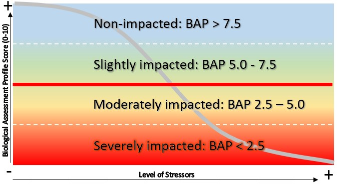

Benthic macroinvertebrate communities were sampled to evaluate water quality impacts to the aquatic life use. Where appropriate riffle habitat was present, collection of macroinvertebrates was preformed using the kick method described in section 9.4 of SOP #208-19 Biological Monitoring of Surface Waters in New York State. With the exception of PEERS sites, replicate (n=4/site) macroinvertebrate samples were collected once at each site during years water chemistries were collected. For traveling kick samples, the contents of replicates for each site were field-inspected to determine major groups of organisms present, and then preserved in alcohol for lab inspection and identification of 100-specimen subsamples. For non-wadable sites, multiplates were deployed for a five-week colonization period, scraped, contents preserved and processed to a minimum of 250 organisms and a quarter of the sample. If target counts were not met, samples were processed in their entirety. Specimens were identified to lowest possible taxonomic resolution, typically genus or species. 

Biological assessments of water quality are generated from Biological Assessment Profile (BAP) scores (SOP #208-19). BAP scores are calculated by taking the average of five normalized 10-scale community metrics and assigning that score to a four-tiered system of impact category of non (7.5-10), slight (5.0-7.5), moderate (2.5-5.0), or severe (0-2.5) impacts see (Figure\@ref(fig:BAP2)). A final BAP score below 5 suggests that the sampled stream is not achieving its aquatic life use goals (Figure 10; SOP #208-19). A BAP score above 5 indicates that the sampled stream is attaining its aquatic life use goals (Figure 10; SOP #208-19). Expected variability in the results of benthic macroinvertebrate community samples is presented in Smith and Bode (2004).



```{r message=FALSE,warning=FALSE, echo=FALSE}
#Andrea's simplified code for only a single point per site
library(tidyverse)

#set up the file path to the metrics data
file.path=file.path(here::here(),
          "data",
          "metrics.csv")

file.path.s<-file.path(here::here(),
                       "data",
                       "sites_wallkill.csv")

metrics.df<-read.csv(file.path,stringsAsFactors = FALSE)
sites<-read.csv(file.path.s,stringsAsFactors = FALSE)
```


```{r BAP2, fig.width=7,fig.height=6.5, message=FALSE, warning=FALSE, echo=FALSE, fig.cap="Biological Assessment Profile (BAP) Scores and 95% confidence intervals for benthic macroinvertebrate community assessment data for the Wallkill River Survey, 2017-2019. Symbology corresponds with WI/PWL segmentation as indicated in the plot legend."}


#need to figure out how to reorder them.
metrics.df<-metrics.df %>% 
  arrange(order)

metrics.df$SH_PWL_ID<-as_factor(metrics.df$SH_PWL_ID)#reorder them first when they have all of the stuff in there

sum.metrics2<-metrics.df%>%
  filter(year>2016)%>%
  rename(BAP=MMDH_BIO_ASMT_PROFILE_SCORE)%>%
  group_by(SH_PWL_ID)%>%
  arrange(SH_PWL_ID) %>% 
  summarise(mean=mean(BAP, na.rm = TRUE),
            N=n(),
            sd=sd(BAP, na.rm = TRUE))%>%
  mutate(se=sd/sqrt(N),
         ci=qt(1 - ((1 - 0.95) / 2), N - 1) * se)%>%
  rename(PWL_ID=SH_PWL_ID)

#create labels
l<-length(sum.metrics2$PWL_ID)

pwl.l<-unique(sum.metrics2$PWL_ID)
l.p<-length(pwl.l)

labels.df <- data.frame(
  label = c("Non", "Slight", "Moderate", "Severe"),
  x = max(l)+1,
  y = c(8.75, 6.25, 3.75, 1.25),
  stringsAsFactors = FALSE)


b2<-ggplot(sum.metrics2, aes(PWL_ID, y=mean))+
  geom_point(size=4)+
  scale_shape_manual(name="PWL Segment ID",values = 0:max(l.p))+
  geom_errorbar(aes(ymin=mean-ci, ymax=mean+ci),  width=.5)+
  theme_bw() + 
  theme(
  panel.grid.major = element_blank(),
  panel.grid.minor = element_blank(),#remove gridlines
  axis.title.y = element_text(
    size = 12,
    family = "serif",
    face = "bold"),
  axis.title.x = element_blank(),
  axis.text.x = element_text(
    angle = 45,
    hjust = 1,
    size = 10,
    family = "serif"), #rotate text angle
  plot.margin = unit(c(0.5, 0.5, 0.5, 0.5), "cm"),
  legend.position = c(.11, .81) + #reduces white space around plot edges
    geom_label(aes(x = .5, y = .5), label = "test")
)+
  geom_hline(yintercept=2.5,linetype="dashed",color="grey")+
  geom_hline(yintercept=5,linetype="dashed",color="grey")+
  geom_hline(yintercept=7.5,linetype="dashed",color="grey")+
  ylab("Biological Assessment Profile Score")+xlab("Year")+ geom_text(data = labels.df, aes(max(l)+1, y, label = label), color = "black",angle=90)+
  expand_limits(y=c(0,10),x=c(0:max(l+2)))
b2

#get unique pwl id's that are below 5. 
bap5<-sum.metrics2 %>% 
  subset(mean<=5) %>% 
  select(PWL_ID)

bap.inc<-sum.metrics2 %>% 
  mutate(mean.plus=mean+ci,mean.mimnus=mean-ci) %>% 
  subset(mean.plus>=5 & mean.plus<=6)

```
 
 On average, Biological Assessment Profile (BAP) scores ranged from severely to slightly impacted across all sites on the WI/PWL segments in the Wallkill watershed a (SOP #208-19). Segments with mean BAP scores that fall below the BAP impairment threshold, include segments `r paste(bap5$PWL_ID,sep=",")` (Figure\@ref(fig:BAP2)). However ninety-five percent confidence intervals suggest inconclusive results for segments  `r paste(bap.inc$PWL_ID,sep=",")`.  


`